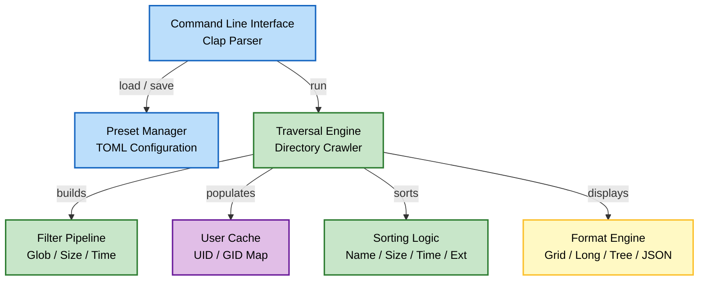
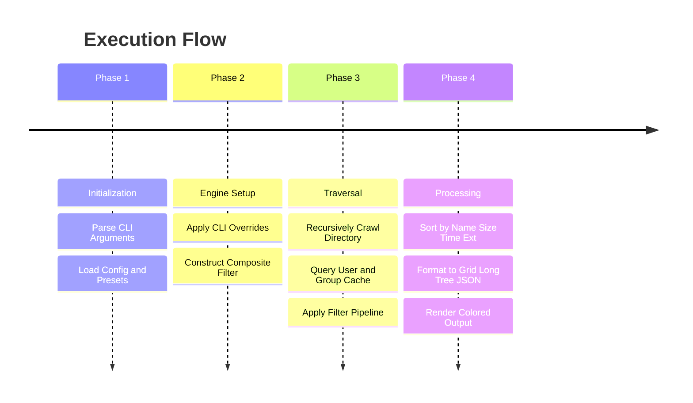

# Phos

High-performance ls clone with search presets in Rust.

## Authors

- [@0xS4cha](https://github.com/0xS4cha)

## Result

Phos provides colored, formatted output directly in your terminal. Here are examples of the different output formats:

### Grid Format (Default)
```
src  Cargo.toml  Cargo.lock  Makefile  LICENSE  README.md
```

### Long List Format
```
drwxr-xr-x user group     0B Jul 18 23:43 src
-rw-r--r-- user group   338B Jul 18 23:43 Cargo.toml
-rw-r--r-- user group  25.1K Jul 18 23:43 Cargo.lock
-rw-r--r-- user group   700B Jul 18 23:43 Makefile
-rw-r--r-- user group  1083B Jul 18 23:43 LICENSE
-rw-r--r-- user group     8B Jul 18 23:43 README.md
```

### Tree Format
```
phos
├── Cargo.toml
├── Cargo.lock
├── Makefile
├── LICENSE
├── README.md
└── src
    ├── main.rs
    ├── engine.rs
    ├── entry.rs
    ├── filter.rs
    ├── sort.rs
    ├── format.rs
    ├── preset.rs
    └── user_cache.rs
```

### JSON Format
```json
[
  {
    "name": "Cargo.toml",
    "path": "d:/phos/Cargo.toml",
    "is_dir": false,
    "is_file": true,
    "is_symlink": false,
    "size": 338,
    "modified": "2026-07-18T23:43:07+02:00",
    "permissions": "rw-r--r--",
    "owner": "user",
    "group": "group"
  }
]
```

## Description

This project is a high-performance command-line utility written in Rust that serves as a modern alternative to the traditional `ls` command. It is designed to quickly scan, filter, sort, and format directory structures using predefined search presets or dynamic command-line options.

Phos integrates fast file system traversal with a flexible composite filtering mechanism (filtering by glob pattern, file extensions, file sizes, modification time) and supports multiple output formats including compact grids, detailed long lists, hierarchical trees, and structured JSON.



## Instruction

Phos is built and managed using Rust's standard package manager, Cargo. A Makefile is also provided for convenience.

### Build from Source

Ensure you have Rust and Cargo installed, then compile the release binary:

```bash
cargo build --release
```

Alternatively, compile and install using the Makefile:

```bash
make release
```

This compiles the release binary and copies it to the root of the project as `./phos`.

### Run Tests

Run the test suite:

```bash
cargo test
```

Or:

```bash
make test
```

## Usage

Phos uses a clean and intuitive Command Line Interface (CLI) built with Clap.

### Basic Commands

List files and directories in the current folder (Grid format by default):
```bash
phos
```

List files in a specific directory:
```bash
phos /path/to/directory
```

### Search Presets

Presets allow you to store search criteria so you do not have to type them every time. Presets are saved in the user's config directory (e.g., `~/.config/phos/presets.toml` on Unix systems or `%APPDATA%\phos\presets.toml` on Windows).

Save a custom search for media files larger than 100MB sorted by size:
```bash
phos --ext=mp4,mkv,avi --min-size="100MB" --sort=size --reverse --save-preset="movies"
```

Run a saved preset:
```bash
phos --preset="movies"
```

The project comes with several default presets:
- `rust`: Find `*.rs` files sorted by modification time (most recent first), displayed in long format.
- `large`: Find files larger than 100MB sorted by size in descending order, displayed in long format.
- `media`: Find common audio and video files sorted by size in descending order.
- `recent`: Find files modified within the last 24 hours (1 day) sorted by time, displayed in long format.

### Filtering Options

Filter by glob pattern matching file names:
```bash
phos -P "*.toml"
```

Filter by one or more comma-separated file extensions:
```bash
phos --ext=rs,toml
```

Filter by minimum and maximum file size (supports units like B, KB, MB, GB, TB):
```bash
phos --min-size="10KB" --max-size="5MB"
```

Filter by modification time (supports s, m, h, d, w units):
```bash
# Modified within the last 12 hours
phos --modified-within="12h"

# Modified before 3 days ago
phos --modified-before="3d"
```

Only list directories:
```bash
phos --dirs-only
```

Only list files:
```bash
phos --files-only
```

Include hidden files and folders:
```bash
phos -a
```

### Traversal and Sorting

Recursively traverse all subdirectories:
```bash
phos -R
```

Recursively traverse up to a maximum depth of 2:
```bash
phos -R --max-depth=2
```

Sort files by size in descending order:
```bash
phos --sort=size --reverse
```

Supported sort fields: `name`, `size`, `time`, `extension`.

### Output Formats

Display in detailed long list format (showing type, permissions, owner, group, size, modification date):
```bash
phos -l
```

Display in a visual directory tree structure:
```bash
phos -t
```

Output as structured JSON:
```bash
phos -j
```

## Algorithms

### Directory Traversal and Filtering

The project implements a fast, depth-first directory traversal:
- **Composite Filter Pattern**: Combines multiple independent filters (glob patterns, extension lists, file size ranges, modification times, hidden flags, and symlink checks) into a single evaluation pipeline.
- **Pre-filtering Optimization**: Prunes unneeded subdirectories and files early during traversal to reduce file system system-calls.
- **Duration Parsing**: Parses human-readable duration strings (e.g., `10s`, `5m`, `2h`, `1d`, `1w`) to filter files modified within a specific timeframe.
- **Size Parsing**: Interprets size suffixes (e.g., `B`, `KB`/`KiB`, `MB`/`MiB`, `GB`/`GiB`, `TB`/`TiB`) to filter files based on byte counts.

### Sorting and Formatting

- **Multi-criteria Sorting**: Sorts entries using fields like name (case-insensitive), size, modification time, or file extension. Supports grouping directories before files (`dirs_first`) and reversing the output order.
- **Output Rendering**:
  - **Grid Format**: Automatically computes terminal dimensions and displays filenames in columns, mimicking standard `ls`.
  - **Long Format**: Renders detailed columns for file permissions, owners, groups, sizes (with human-readable byte conversion), modification times, and symlink targets.
  - **Tree Format**: Recursively visualizes the directory tree with connectors (`├──`, `└──`), colorized by file type.
  - **JSON Format**: Exports metadata as structured JSON arrays for scripting and integration.
  - **Colored Terminal Output**: Leverages the `colored` crate to apply custom styles based on file type and extensions (e.g., blue for directories, cyan for symlinks, green for executables, yellow for code, red for archives).

### Cross-platform Metadata Handling

- **Unix Systems**: Queries file metadata (uid, gid, mode) natively using platform-specific extensions, mapping permissions strings (`rwxr-xr-x`) and retrieving system usernames and group names via `/etc/passwd` and `/etc/group` with local caching.
- **Other Systems (e.g., Windows)**: Safely falls back to generic permission strings and placeholders without failing, ensuring portable utility execution.



## Project Structure

```
│  Cargo.toml       # Cargo project manifest and dependencies
│  Cargo.lock       # Cargo lockfile
│  Makefile         # Build, test, and formatting shortcuts
│  LICENSE          # License file (MIT)
└  src/
   ├── main.rs      # Application entry point and CLI parsing (Clap)
   ├── engine.rs    # Traversal engine and directory crawler
   ├── entry.rs     # Metadata representation of file system entries
   ├── filter.rs    # Filter pipeline (Composite, Glob, Size, Type, Date)
   ├── sort.rs      # Sorting algorithms (Name, Size, Time, Extension)
   ├── format.rs    # Layout formatters (Grid, Long, Tree, JSON)
   ├── preset.rs    # Preset configuration and TOML parser
   └── user_cache.rs# Cache for username and groupname lookup
```

## Resources

- [Rust](https://www.rust-lang.org/) — Programming language
- [Cargo](https://doc.rust-lang.org/cargo/) — Rust package manager
- [Clap](https://docs.rs/clap/latest/clap/) — Command Line Argument Parser for Rust
- [Serde](https://serde.rs/) — Serialization and Deserialization library
- [Chrono](https://docs.rs/chrono/latest/chrono/) — Date and Time library for Rust
- [Colored](https://docs.rs/colored/latest/colored/) — Terminal coloring library
- [Terminal Size](https://docs.rs/terminal_size/latest/terminal_size/) — Terminal dimensions library

## Disclaimer

IMPORTANT — Educational use only:
- Use this repository for study and reference only.

## Feedback

If you have feedback, open an issue or contact the author.
